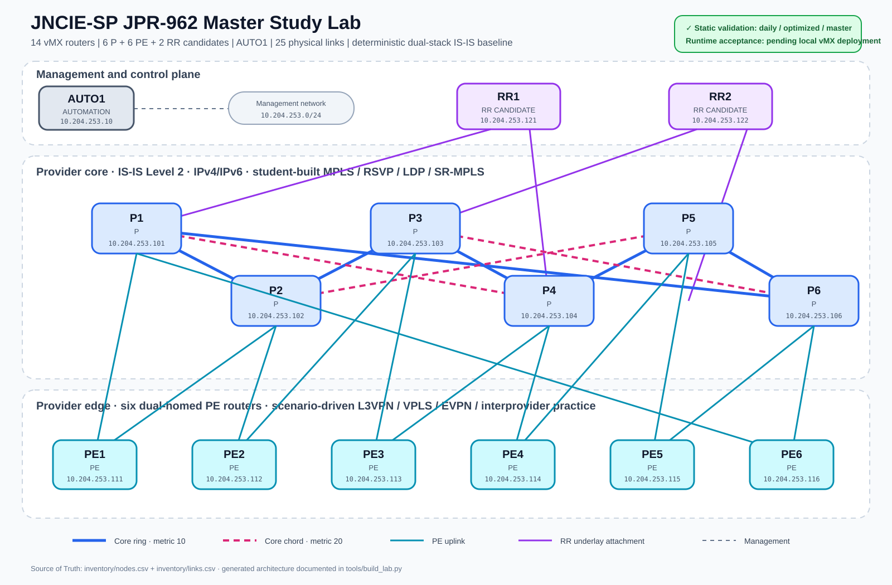

# JNCIE-SP JPR-962 Study Lab

[](https://github.com/dfonquet/jncie-sp-master-lab/actions/workflows/validate.yml)
[](LICENSE)
[](https://containerlab.dev/)
[](#juniper-image-and-legal-boundary)

An independent, reproducible Containerlab platform for designing,
configuring and troubleshooting Junos service-provider networks against the
public JNCIE-SP JPR-962 objectives.

CSV inventories are the **Source of Truth**. Python deterministically generates
Containerlab topology files, minimal Junos startup configurations and
dual-stack addressing plans. Advanced services remain student work.

> [!IMPORTANT]
> This is an independently authored study platform, not Juniper's official
> exam lab. Runtime acceptance is claimed only when corresponding local vMX
> evidence has been captured.

## Navigate the project

[Architecture](docs/NETWORK-TOPOLOGY.md) ·
[Addressing](docs/ADDRESSING-PLAN.md) ·
[Blueprint coverage](docs/BLUEPRINT-COVERAGE.md) ·
[Validation](docs/VALIDATION.md) ·
[Scenarios](scenarios/README.md) ·
[Mock exam](docs/MOCK-EXAM-GUIDE.md) ·
[Security](docs/SECURITY.md) ·
[Contributing](CONTRIBUTING.md)

## Project status

| Capability | Status | Acceptance boundary |
| --- | --- | --- |
| vMX image and interface contract | Observed locally | Canary testing established `eth1` → `ge-0/0/1`; port zero is excluded. |
| Daily, optimized and master generation | Validated statically | CI regenerates artifacts and checks schemas, addressing, ports, topology and determinism. |
| Runtime acceptance framework | Implemented | Credentials, AUTO1, FPCs, alarms, interfaces, IS-IS, routes and pings fail closed. |
| Full profile runtime evidence | Pending controlled rerun | Public CI cannot boot licensed vMX; evidence must be produced locally. |
| Advanced services | Student exercises | No BGP, MPLS, VPN, EVPN, multicast, CoS or security solution is pre-installed. |

## Architecture overview

```text
CSV inventories
      │
      ▼
Python generator ──► Containerlab YAML ──► isolated lab profile
      ├────────────► Junos startup configurations
      └────────────► addressing documentation

AUTO1 ─────────────► management, automation and acceptance evidence
Scenarios ─────────► temporary initial, fault, check and cleanup state
```



The detailed [physical and logical topology guide](docs/NETWORK-TOPOLOGY.md)
contains dedicated Daily, Optimized, Master and service-overlay diagrams.

## Supported profiles

| Profile | vMX | P | PE | RR candidates | Links | Primary use |
| --- | ---: | ---: | ---: | ---: | ---: | --- |
| `daily` | 8 | 3 | 3 | 2 | 13 | Routine protocol work and lowest normal resource pressure |
| `optimized` | 10 | 4 | 4 | 2 | TE, protection, ECMP and richer path diversity |
| `master` | 14 | 6 | 6 | 2 | Integrated failures and six-hour mock-exam sessions |

Each profile also includes one management-only AUTO1 container. Run **only one
resource-intensive profile at a time**.

## Baseline boundary

| Baseline | Generated state | Intentionally absent |
| --- | --- | --- |
| `mgmt-only` | Hostname, SSH, NETCONF, router identity and physical interface declarations | IGP and all advanced services |
| `isis` | Management state plus dual-stack loopbacks, point-to-point addressing and IS-IS Level 2 metrics | BGP, MPLS, LDP, RSVP, SR-MPLS, VPNs, VPLS, EVPN, CoS, telemetry and security policy |
| Scenario overlay | Explicit exercise-specific initial or faulty state | Unrelated solutions and permanent feature accumulation |

The baseline supplies stable connectivity without solving the technologies the
student is expected to configure, break, diagnose and rebuild.

## Requirements

- Linux host with Docker, Containerlab and functional nested KVM
- Python 3.11 or newer
- Authorized local `vrnetlab/vr-vmx:21.3R1.9-prepared` image
- Recommended tested host class: 16 vCPU and approximately 65 GiB RAM
- Git for deterministic-diff and contribution workflows

## Quick start

Start with the Daily profile. The commands below generate and validate before
deploying anything:

```bash
git clone https://github.com/dfonquet/jncie-sp-master-lab.git
cd jncie-sp-master-lab

python3 -m pip install -r requirements-dev.txt
make PROFILE=daily BASELINE=isis validate
make daily-plan
make automation-image
make daily-up
```

Confirm that no second lab is active before deployment:

```bash
docker ps --format '{{.Names}}' | grep '^clab-' || echo "No active Containerlab lab"
```

Destroy the profile after the session:

```bash
make daily-down
```

## Generation and static validation

```bash
python3 tools/build_lab.py --profile daily --baseline isis
python3 tools/validate_artifacts.py --profile daily --baseline isis
python3 -m pytest -q
git diff --check
git diff --exit-code
```

Use `optimized` or `master` as the profile when required. Environment variables
`JNCIE_PROFILE` and `JNCIE_BASELINE` are supported. `full` is a compatibility
alias for `master`. Never edit generated artifacts directly.

## Runtime acceptance

Runtime acceptance is local because public GitHub runners do not have the
licensed vMX image:

```bash
export JUNOS_USERNAME=admin
read -rsp "Junos password: " JUNOS_PASSWORD
export JUNOS_PASSWORD
echo

python3 automation/scripts/validate_runtime.py \
  --profile daily \
  --baseline isis
```

The command writes JSON and Markdown evidence and follows a strict exit
contract:

| Exit code | Meaning |
| ---: | --- |
| `0` | AUTO1 and every selected Junos node passed all applicable gates |
| `1` | One or more operational acceptance checks failed |
| `2` | Required Junos credentials were not supplied |

See [Validation and Acceptance](docs/VALIDATION.md) for the complete gate.

## Recommended study workflow

1. Generate and statically validate `daily`.
2. Confirm the active-lab guard and available host resources.
3. Review the Containerlab plan before deployment.
4. Deploy and wait for every vMX health check.
5. Run runtime acceptance and preserve sanitized evidence.
6. Apply one scenario; do not accumulate unrelated configurations.
7. Diagnose, verify, score and clean up the scenario.
8. Destroy the profile and confirm that its management network was removed.
9. Move to `optimized` or `master` only when the exercise requires it.

The [scenario catalog](scenarios/README.md) and
[mock-exam guide](docs/MOCK-EXAM-GUIDE.md) define task, scoring and evidence
contracts. The [coverage matrix](docs/BLUEPRINT-COVERAGE.md) maps work to the
public JNCIE-SP domains without reproducing confidential exam material.

## Repository map

| Path | Responsibility |
| --- | --- |
| `inventory/` | Authoritative node and link CSV inventories with explicit ports |
| `tools/` | Profile model, deterministic generator and static validators |
| `topology/` | Generated Containerlab definitions |
| `configs/` | Generated minimal Junos baselines |
| `automation/` | AUTO1 image, stack verification and strict PyEZ acceptance |
| `profiles/canary/` | Licensed-image and interface capability checks |
| `scenarios/` | Exercise contracts, faults, checks, cleanup, solutions and evidence |
| `tests/` | Unit, regression and mocked runtime-decision tests |
| `docs/` | Architecture, addressing, validation and study guides |

## Resource and safety rules

vMX is CPU- and memory-intensive, especially during staggered startup. Monitor
`free -h`, `uptime` and `docker stats`. Stop if the host swaps, containers
restart, FPCs remain offline or sustained CPU load compromises responsiveness.

Never commit credentials, private keys, images, disks, backups, packet
captures, core dumps or unsanitized runtime reports. Use environment variables
or ignored local files and follow the [security guide](docs/SECURITY.md).

## Juniper image and legal boundary

Juniper software is not included. Obtain vMX through an authorized channel,
accept the applicable vendor license and build the vrnetlab image outside this
repository.

Original repository content is published under the [Creative Commons
Attribution 4.0 International License](LICENSE). Juniper software, Junos OS,
vMX images, vendor documentation, trademarks and certification exam content
are excluded and remain subject to their respective owners and license terms.
This independent project is not affiliated with, sponsored by, or endorsed by
Juniper Networks and does not represent its confidential examination
environment.

## Roadmap

1. Record a fresh Daily runtime-acceptance report after the next controlled VM deployment.
2. Isolate generated `mgmt-only` and `isis` outputs and validate both in CI.
3. Convert `CORE-ISIS-001` into the first end-to-end executable scenario.
4. Expand additional independently authored scenarios from the coverage matrix.
5. Add an optional hardened self-hosted integration workflow.
