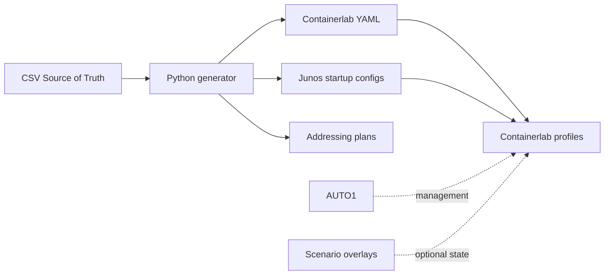

# JNCIE-SP JPR-962 Study Lab

An independent, reproducible Containerlab platform for building and
troubleshooting Junos service-provider networks against the public JNCIE-SP
JPR-962 objectives. CSV inventories are the Source of Truth; Python generates
stable topology YAML, minimal startup configurations and addressing plans.

## Current project status

The canary and earlier local vMX boot tests established the image/interface
contract. Daily, optimized and master artifacts are generated and statically
validated. Advanced services are scenario work and are not claimed as runtime
validated unless evidence is recorded. This is not Juniper's official exam lab.

## Scope and non-goals

The repository provides physical infrastructure, deterministic addressing,
minimal baseline modes, validation, automation and an exercise framework. It
does not include licensed images, credentials, official exam content, complete
solutions or a permanently configured “everything enabled” network.

## Architecture overview



See [physical and logical topology](docs/NETWORK-TOPOLOGY.md).

## Supported profiles

| Profile | vMX nodes | P | PE | RR | Physical links | AUTO1 | Intended use |
| --- | ---: | ---: | ---: | ---: | ---: | --- | --- |
| daily | 8 | 3 | 3 | 2 | 13 | Yes | Routine protocol and service study |
| optimized | 10 | 4 | 4 | 2 | 18 | Yes | TE, protection, ECMP and richer path work |
| master | 14 | 6 | 6 | 2 | 25 | Yes | Integrated failures and six-hour mock exams |

Only one resource-intensive profile should be active at a time.

## Baseline configuration boundary

- `mgmt-only`: hostname, SSH/NETCONF, router identity and interface availability;
  no IGP or advanced protocols.
- `isis`: dual-stack loopbacks/links and IS-IS Level 2 with metrics.
- `scenario`: a separately selected initial/fault state layered on either base.

BGP, MPLS, LDP, RSVP, SR-MPLS, VPNs, VPLS, EVPN, CoS, telemetry and security
features remain student exercises.

## JNCIE-SP objective alignment

The [coverage matrix](docs/BLUEPRINT-COVERAGE.md) maps the current official
System Management and Monitoring, Core Technologies and Edge Services domains.
Multicast is supplementary because it appears in the exam description but not
as a separate domain in the current high-level table.

## Repository layout

| Path | Purpose |
| --- | --- |
| `inventory/` | Authoritative node/link CSV files with explicit ports |
| `tools/` | Profile model, deterministic generator and static validator |
| `topology/`, `configs/`, `docs/*ADDRESSING*` | Generated artifacts |
| `automation/` | AUTO1 image and optional PyEZ runtime validation |
| `profiles/canary/` | Licensed-image capability checks |
| `scenarios/` | Tasks, faults, checks, solutions and mock-exam structure |
| `tests/` | Unit and regression tests |

## Requirements

- Linux host with Docker, Containerlab and working nested KVM
- Python 3.11+ with `requirements-dev.txt`
- Authorized local `vrnetlab/vr-vmx:21.3R1.9-prepared` image
- Recommended existing host class: 16 vCPU and approximately 65 GiB RAM

## Juniper image and licensing requirements

Juniper software is not included. Obtain vMX through an authorized channel,
accept the applicable license and build the vrnetlab image outside this repo.
The validated local mapping is `eth1` → `ge-0/0/1`; port zero is rejected.

## Quick start

```bash
python3 -m pip install -r requirements-dev.txt
make PROFILE=daily BASELINE=isis validate
make daily-plan
make automation-image
make daily-up
```

Destroy the profile when finished: `make daily-down`.

## Build and generation workflow

```bash
python3 tools/build_lab.py --profile daily --baseline isis
python3 tools/build_lab.py --profile optimized --baseline isis
python3 tools/build_lab.py --profile master --baseline isis
```

`JNCIE_PROFILE` and `JNCIE_BASELINE` remain supported. `full` is a compatibility
alias for `master`. Never edit generated artifacts directly.

## Static validation workflow

```bash
python3 tools/validate_artifacts.py --profile daily --baseline isis
python3 -m pytest -q
git diff --check
git diff --exit-code
```

## Runtime acceptance workflow

Runtime acceptance is optional and local because public CI has no licensed vMX:

```bash
export JUNOS_USERNAME=admin
read -rsp "Junos password: " JUNOS_PASSWORD; export JUNOS_PASSWORD; echo
python3 automation/scripts/validate_runtime.py --profile daily --baseline isis
```

See the [validation guide](docs/VALIDATION.md).

## Daily study workflow

Generate, validate, dry-run, deploy only `daily`, apply one scenario manually,
capture evidence, remove scenario state, then destroy the lab. Use `optimized`
only when path diversity is material to the exercise.

## Scenario and mock-exam workflow

The [scenario catalog](scenarios/README.md) defines a common task contract and
five foundational examples. The [mock-exam guide](docs/MOCK-EXAM-GUIDE.md)
defines an independently authored six-hour workflow with scoring and evidence.

## Resource considerations

vMX is CPU- and memory-intensive, especially during staggered startup. Daily is
the normal profile. Monitor `free -h`, `uptime`, and `docker stats`; stop if the
host begins swapping or sustained load compromises router responsiveness.

## Security and secret handling

Never commit credentials, private keys, images, disks, backups, captures, core
dumps or unsanitized reports. Use environment variables or ignored local files.
See [Security](docs/SECURITY.md).

## Contribution workflow

Create a focused branch, regenerate all affected profiles, run static tests and
submit generated artifacts with their Source-of-Truth change. See
[CONTRIBUTING.md](CONTRIBUTING.md).

## Roadmap

1. Runtime-accept the regenerated daily baseline.
2. Add scenario-specific PyEZ checks and evidence schemas.
3. Expand planned objective placeholders into independently authored tasks.
4. Add an optional self-hosted integration workflow after runner hardening.

## Reference documents

- [Daily topology](docs/DAILY-TOPOLOGY.md)
- [Optimized topology](docs/OPTIMIZED-TOPOLOGY.md)
- [Master topology](docs/TOPOLOGY.md)
- [Daily](docs/DAILY-ADDRESSING-PLAN.md), [optimized](docs/OPTIMIZED-ADDRESSING-PLAN.md), and [master](docs/ADDRESSING-PLAN.md) addressing
- [Blueprint coverage](docs/BLUEPRINT-COVERAGE.md)
- [Scenario catalog](scenarios/README.md)
- [Validation](docs/VALIDATION.md)
- [Contributing](CONTRIBUTING.md)

## License and legal disclaimer

Project code and documentation use the [MIT License](LICENSE). Juniper and vMX
are trademarks or products of their respective owner and remain governed by
their license terms. This independent project is not affiliated with, endorsed
by or representative of Juniper's confidential examination environment.
