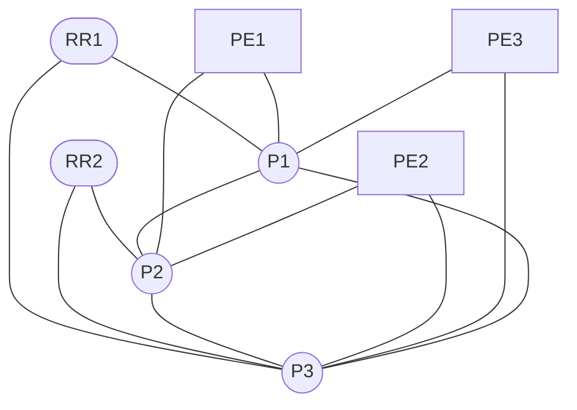

# Daily JNCIE-SP Study Topology

This is the resource-balanced profile for routine study: three P routers,
three dual-homed PE routers, two dual-homed route reflectors, AUTO1, and
thirteen physical links. The P triangle has no single-link failure that
partitions the core. Logical systems, routing instances, and logical-tunnel
interfaces provide additional CE, ASBR, Internet, and customer roles without
booting more vMX instances.

## Baseline boundary

The generated startup configuration supplies management, dual-stack /31 and
/127 links, loopbacks, and one IS-IS Level 2 domain. It intentionally does not
preconfigure BGP, MPLS, RSVP, LDP, SR-MPLS, VPNs, EVPN, CoS, telemetry, or
security exercises. Those technologies remain student work.

## Why this is the default

Live measurements on the 16-vCPU, 65-GiB VM showed that the ten-vMX extended
profile was healthy but sustained a load near 13 and used about 45 GiB. The
daily profile removes one P and one PE while retaining redundant PE and RR
attachment, reducing steady CPU pressure by roughly two vMX instances.

Use `topology/jncie-sp-optimized.clab.yml` when a fourth P/PE pair is materially
useful, and never run both profiles simultaneously.

The generated topology also includes AUTO1 on the management network; it does
not consume any of the thirteen provider data-plane links.
