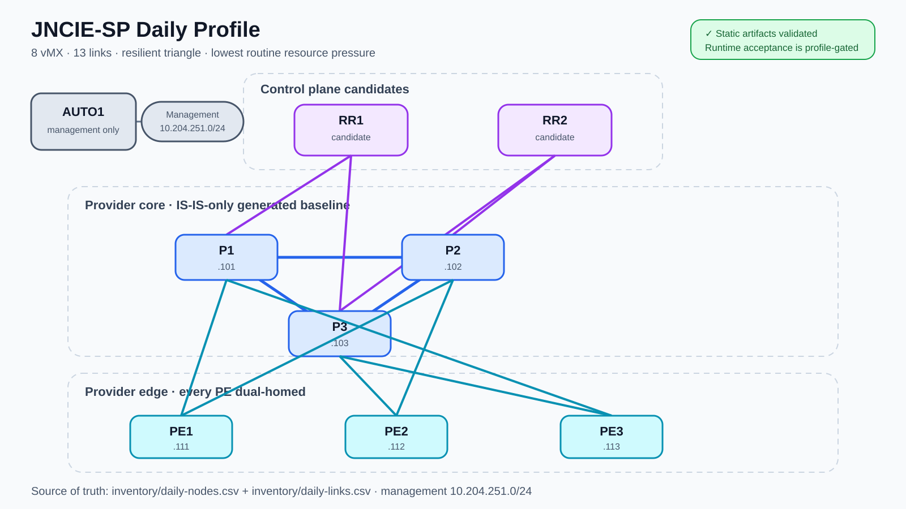
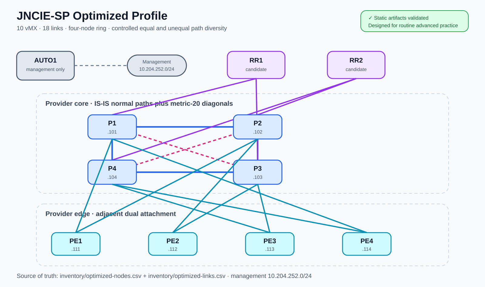
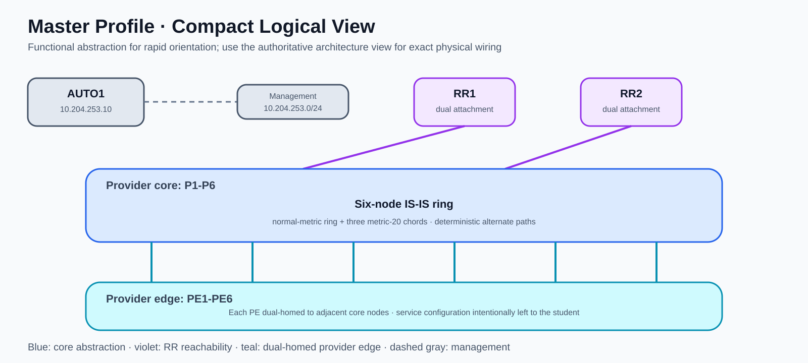
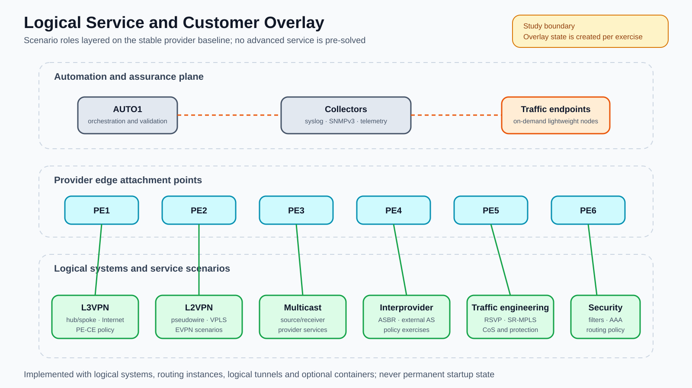

# Physical and Logical Network Topology

The diagrams describe this independent study platform, not an unpublished or
official Juniper exam topology. CSV inventories are authoritative; diagrams
explain the generated physical design.

## Daily profile

Eight vMX routers use thirteen data-plane links. The P triangle remains
connected after one core-link failure; every PE and RR candidate is dual-homed.
This is the default because it preserves useful path diversity with the lowest
routine CPU and memory pressure.

## Optimized profile

Ten vMX routers and eighteen links provide alternate equal and unequal paths
for RSVP-TE, primary/secondary LSPs, protection, administrative groups, BFD,
ECMP, SR-MPLS, LDP/SR interworking and path-dependent CoS exercises.

## Master profile

### Authoritative architecture view

The architecture view above is the primary visual reference for the full
profile. It presents the management plane, route-reflector candidates,
provider core and provider edge as separate functional layers while preserving
the exact physical relationships generated by the repository.

| Layer | Nodes | Design intent |
| --- | --- | --- |
| Automation and management | AUTO1 and `10.204.253.0/24` | Out-of-band access, configuration generation, validation and evidence collection. |
| Control plane | RR1 and RR2 | Redundant route-reflector candidates connected to different core attachment points; advanced BGP roles remain student exercises. |
| Provider core | P1-P6 | Six-node ring with three higher-metric chords for deterministic primary paths and controlled alternates. |
| Provider edge | PE1-PE6 | Each PE is dual-homed to adjacent P routers, avoiding a single core attachment dependency. |

The solid blue ring links use the normal IS-IS metric. Dashed violet chords
use metric 20 and create deliberately unequal alternate paths. Teal links are
the dual attachments between the provider edge and core. Purple links connect
the RR candidates to geographically separated core positions. The management
network is independent of all provider data-plane links.

The diagram is explanatory rather than a second source of configuration data.
The authoritative inputs remain:

- [`inventory/nodes.csv`](../inventory/nodes.csv) for node roles,
  management addresses, loopbacks and IS-IS identifiers;
- [`inventory/links.csv`](../inventory/links.csv) for endpoints,
  interface assignments, IPv4/IPv6 subnets and metrics;
- [`tools/build_lab.py`](../tools/build_lab.py) for deterministic topology and
  baseline generation.

After changing any source input, regenerate and validate the artifacts before
updating the SVG. This prevents a visually attractive diagram from drifting
away from the deployable topology.

### Compact logical view

Fourteen vMX routers and twenty-five links form a six-P ring with three
higher-metric chords. Chords provide controlled alternates without replacing
normal ring paths. The profile supports broad failure injection and six-hour
integrated mock exams, but its resource cost makes it unsuitable as the daily
default. The generated baseline establishes management access, deterministic
dual-stack addressing and IS-IS connectivity; it intentionally does not
pre-solve MPLS services, BGP policy, VPN, multicast, CoS or security exercises.

## Interface contract

The validated local image maps Containerlab `eth1` to Junos `ge-0/0/1`;
`ge-0/0/0` is unavailable as a normal lab-facing interface. Every CSV link has
explicit `a_port` and `b_port` fields, so row ordering cannot change wiring.
AUTO1 uses only the management network and consumes no provider data-plane link.

## Logical Service and Customer Overlay

Logical systems, routing instances, logical-tunnel interfaces, bridge domains
and VLANs emulate customers, PE-CE endpoints, Internet and interprovider roles.
Lightweight on-demand containers provide traffic and collector functions.
These overlays are scenario state, never permanent baseline configuration.
