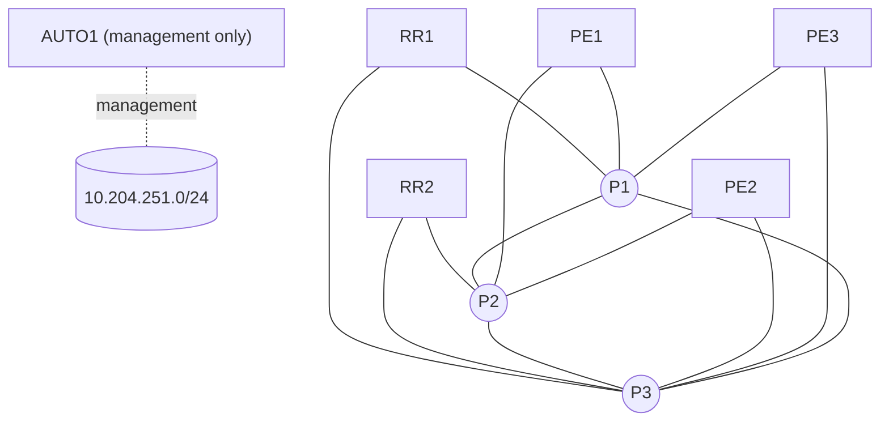
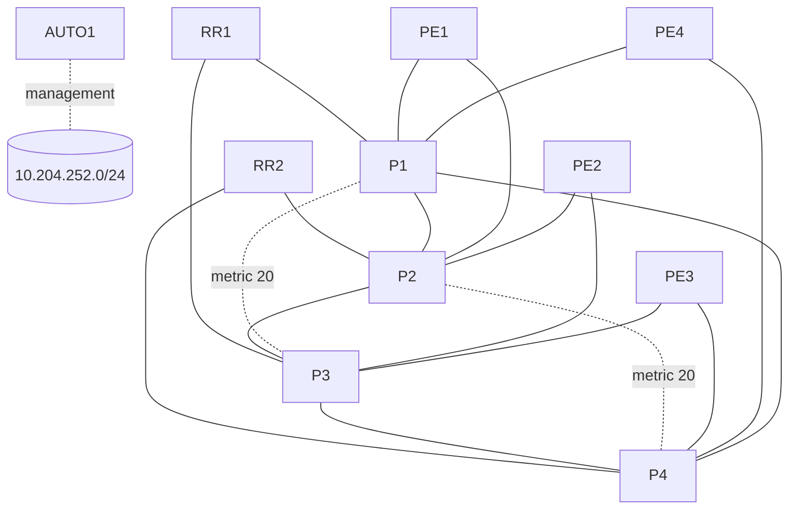
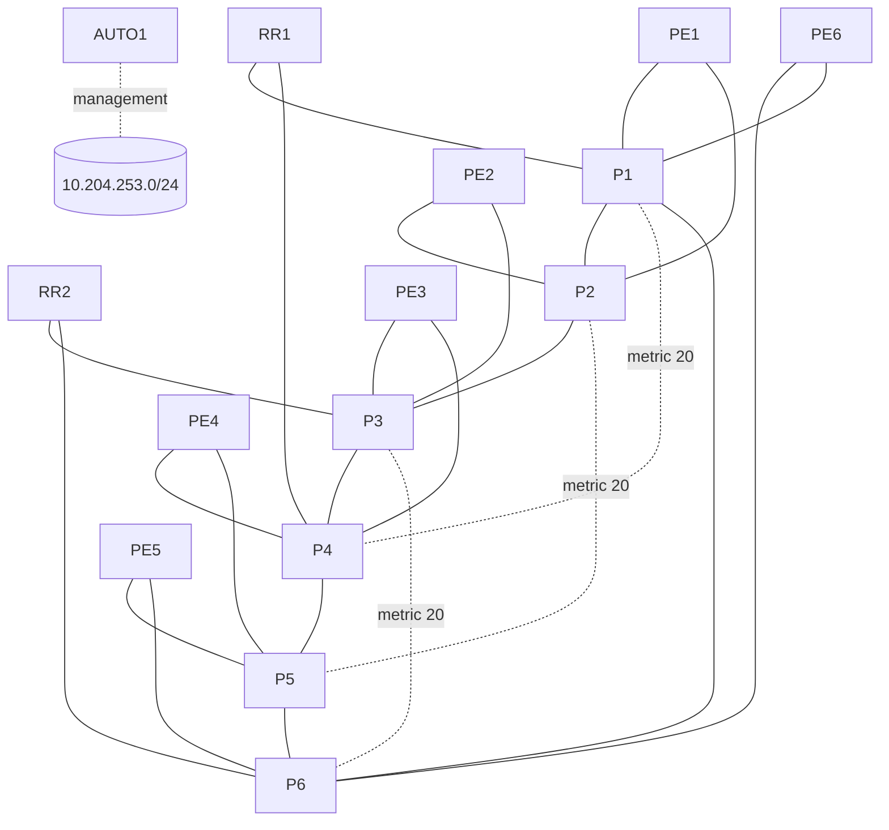
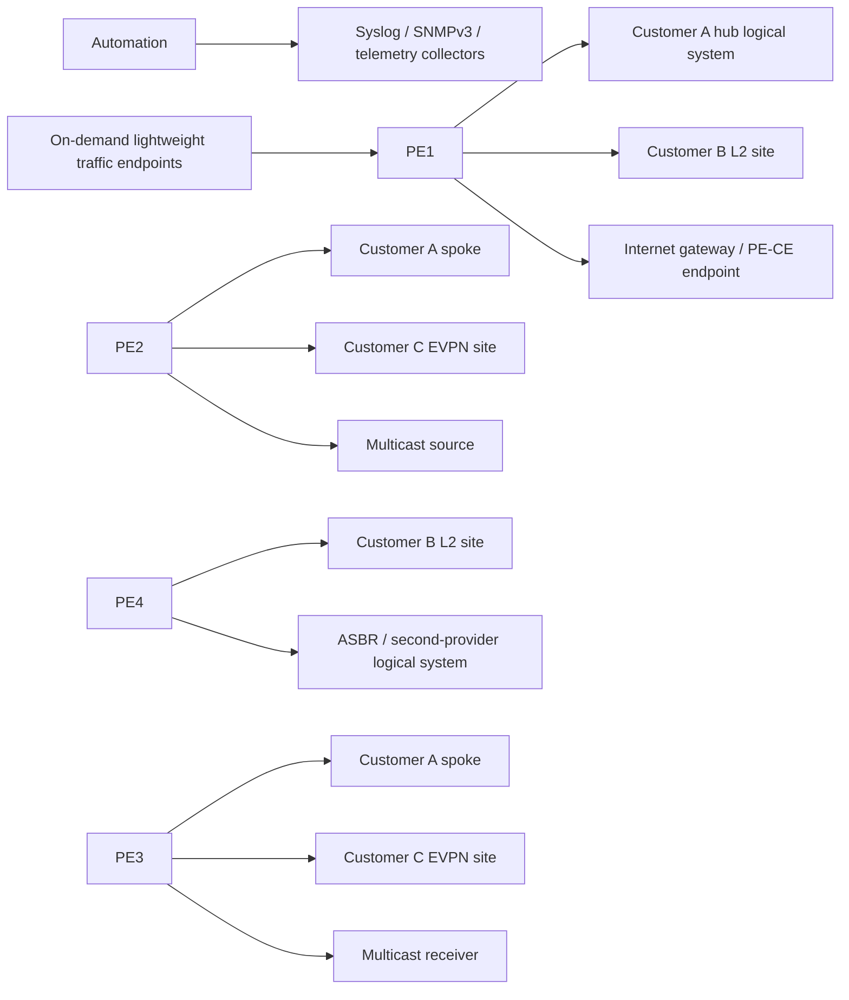

# Physical and Logical Network Topology

The diagrams describe this independent study platform, not an unpublished or
official Juniper exam topology. CSV inventories are authoritative; diagrams
explain the generated physical design.

## Daily profile

Eight vMX routers use thirteen data-plane links. The P triangle remains
connected after one core-link failure; every PE and RR candidate is dual-homed.
This is the default because it preserves useful path diversity with the lowest
routine CPU and memory pressure.

## Optimized profile

Ten vMX routers and eighteen links provide alternate equal and unequal paths
for RSVP-TE, primary/secondary LSPs, protection, administrative groups, BFD,
ECMP, SR-MPLS, LDP/SR interworking and path-dependent CoS exercises.

## Master profile

Fourteen vMX routers and twenty-five links form a six-P ring with three
higher-metric chords. Chords provide controlled alternates without replacing
normal ring paths. The profile supports broad failure injection and six-hour
integrated mock exams, but its resource cost makes it unsuitable as the daily
default.

## Interface contract

The validated local image maps Containerlab `eth1` to Junos `ge-0/0/1`;
`ge-0/0/0` is unavailable as a normal lab-facing interface. Every CSV link has
explicit `a_port` and `b_port` fields, so row ordering cannot change wiring.
AUTO1 uses only the management network and consumes no provider data-plane link.

## Logical Service and Customer Overlay

Logical systems, routing instances, logical-tunnel interfaces, bridge domains
and VLANs emulate customers, PE-CE endpoints, Internet and interprovider roles.
Lightweight on-demand containers provide traffic and collector functions.
These overlays are scenario state, never permanent baseline configuration.
