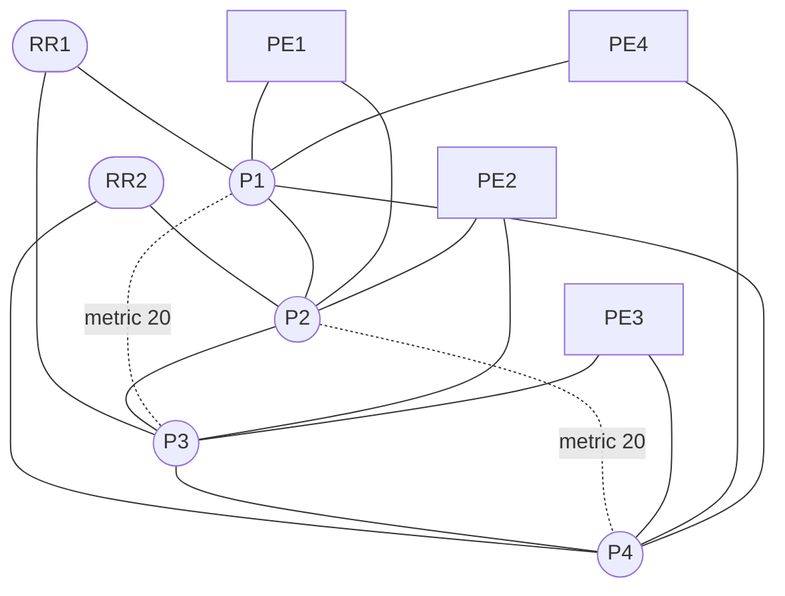

# Resource-Optimized JNCIE-SP Topology

This is the extended path-diversity profile: ten vMX routers, eighteen
point-to-point links, dual-stack addressing, and an IS-IS Level 2 baseline.

## Why ten vMX routers

- Four P routers provide a redundant ring and two alternate core chords.
- Four dual-homed PE routers provide enough sites for hub-and-spoke, Internet
  access, VPLS, EVPN, interprovider, and failure exercises.
- Two dual-homed RR routers support route-reflection and control-plane
  resiliency exercises without preconfiguring BGP.
- Earlier local measurements showed ten healthy vMX instances could consume
  about 45 GiB and sustain substantial CPU load. Re-measure after image or host
  changes; use the daily profile for routine work.

## Virtual expansion instead of more vMX

Use Junos logical systems, routing instances, and logical tunnel interfaces
on the four PE routers for customer and interprovider roles. These are student
exercise overlays and are not present in the baseline.

| Reserved use | Suggested location | Purpose |
| --- | --- | --- |
| CE-A / CE-B | PE1 and PE3 logical systems | PE-CE static, OSPF, IS-IS and BGP |
| Hub / spokes | PE1, PE2 and PE4 routing instances | L3VPN topology and Internet access |
| ASBR-A / ASBR-B | PE2 and PE4 logical systems | Interprovider options and carrier-of-carriers |
| L2 customer sites | PE1 through PE4 logical systems | BGP/LDP VPLS and EVPN exercises |
| Traffic endpoints | On-demand lightweight Linux namespaces | Ping, multicast and CoS verification |

## Baseline boundary

Only management, IPv4/IPv6 infrastructure addressing, loopbacks, and IS-IS
Level 2 are generated. Everything else remains an exercise.
