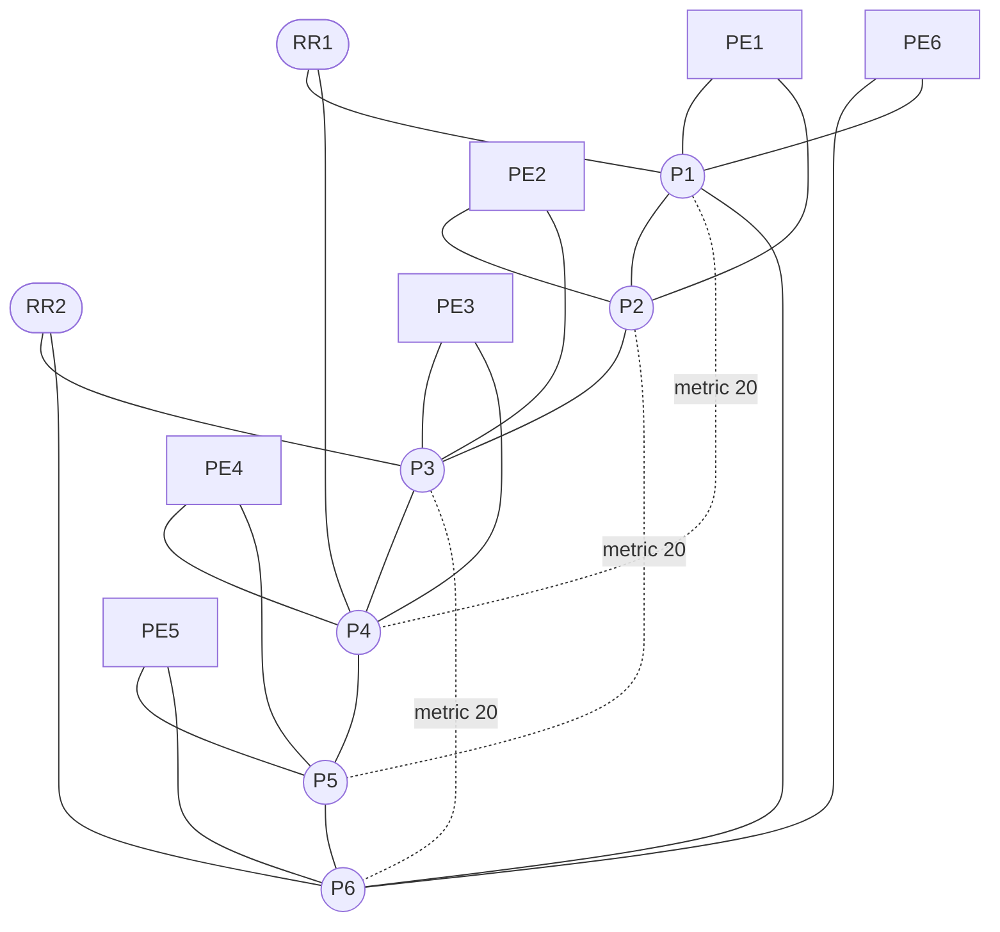

# JNCIE-SP Master Topology

The master profile contains fourteen Juniper vMX routers, AUTO1 on the
management network, and twenty-five
point-to-point links. It intentionally provides only dual-stack addressing and
a single IS-IS Level 2 underlay. All advanced service-provider technologies
remain student work.

## Design rationale

- The six-P ring survives any single core-link failure.
- Three higher-metric chords provide alternate paths and useful metric and
  convergence exercises without forcing an artificial full mesh.
- Every PE is dual-homed to adjacent P routers.
- Each RR candidate has two physically diverse underlay paths.
- RR nodes participate only in the IS-IS base. No BGP role is preconfigured.
- `/31` and `/127` point-to-point addressing follows operationally efficient
  provider practice.
- Startup delays are spaced by 45 seconds to control vMX boot pressure.

## Student boundary

The generated base does not configure BGP, MPLS, LDP, RSVP, segment routing,
VPNs, multicast, class of service, security policies, telemetry, or service
automation. Those capabilities are intentionally left for study exercises.
